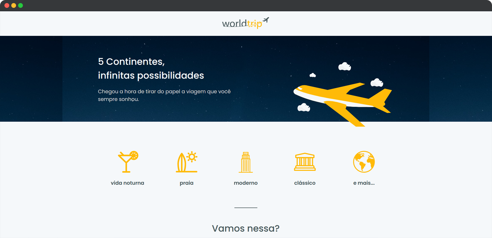

<h1 align="center">
  
</h1>

<p align="center">
  

  
</p>

<br>

<p align="center">
  
</p>

<br>

## 🧪 Tecnologias

Esse projeto foi desenvolvido com as seguintes tecnologias:

- [React](https://reactjs.org)
- [NextJS](https://nextjs.org/)
- [Chakra UI](https://chakra-ui.com/)
- [Sass](https://sass-lang.com/)
- [Swiper](https://swiperjs.com/)
- [Axios](https://github.com/axios/axios)
- [JSON Server](https://github.com/typicode/json-server)
- [TypeScript](https://www.typescriptlang.org/)

## 💻 Projeto

O projeto tem como objetivo o estudo e desenvolvimento de uma aplicação em React com NextJS utilizando a biblioteca de componentes Chakra UI e Swiper para desenvolvimento de carousel.

worldtrip foi desenvolvido utilizando o framework NextJS utilizando o Chakra UI para montagem da interface, React Hook Form para gerenciamento dos formulários, Yup para validação de formulários e MirageJS para simular uma API.

Este é um projeto desenvolvido como prática das aulas do Chapter IV da trilha ReactJS do **[Programa Ignite](https://www.rocketseat.com.br/ignite)** da Rocketseat.

## 🚀 Como executar

Clone o projeto e acesse a pasta do mesmo.

```bash
$ git clone https://github.com/rafaelramosdev/worldtrip
$ cd worldtrip
```

Para iniciá-lo, siga os passos abaixo:

```bash
# Instala as dependências
$ yarn

# Inicia o json-server
$ yarn server

# Inicia o website
$ yarn dev
```

O website estará disponível no seu navegador pelo endereço [`http://localhost:3000`](http://localhost:3000).

## 📄 Licença

Esse projeto está sob a licença MIT. Veja o arquivo [LICENSE](LICENSE) para mais detalhes.

---

Feito by [Rafael Ramos](https://rafaelramos.dev/) 🙋🏻‍♂️
